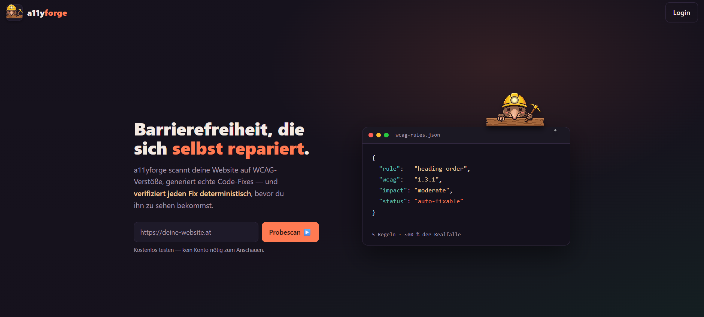
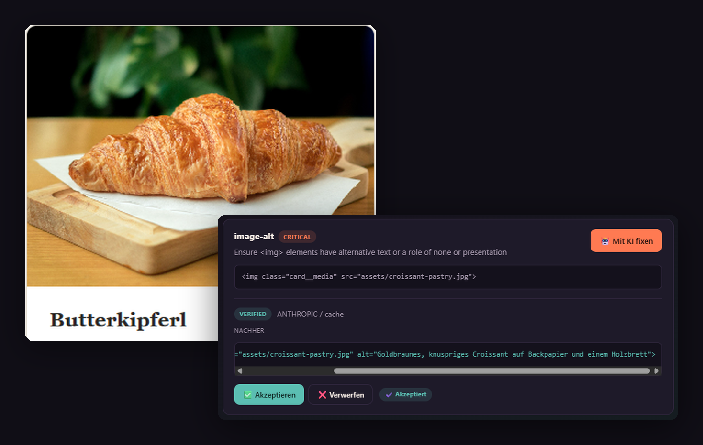
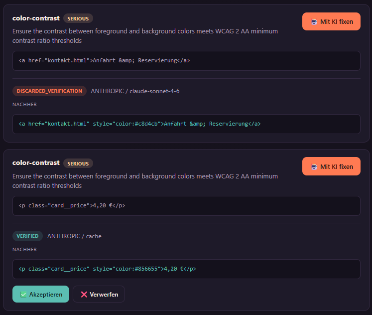

# A11yForge

> A verified accessibility auto-fixer — repairs broken HTML instead of just reporting
> violations, with every AI-generated fix deterministically validated before it reaches
> a human reviewer.



---

## The Problem

Accessibility linters flag violations. Developers ignore the reports. Sites remain inaccessible.

Since the European Accessibility Act (EAA) came into force in June 2025, this is no longer just
an ethical question — it's a legal requirement for many businesses across the EU. But the
accessibility gap remains massive because reporting a problem is not the same as fixing it.

## The Approach

A11yForge does not stop at reports. It:

1. **Analyzes** the target site — Playwright renders each page, axe-core checks it against a
   fixed WCAG rule set, and the rendered HTML is stored alongside every violation
2. **Asks Claude** (Anthropic API) to propose a targeted fix for the offending HTML snippet
3. **Verifies** each proposed fix deterministically — the patch is applied to the original page
   in a headless browser and the same rule checks are run again against the modified DOM
4. **Only accepts** fixes that resolve the original violation without introducing new ones
5. **Presents** verified fixes to a human reviewer for final approval

The verification layer is the key: AI proposes, deterministic rules verify. No unchecked AI
output ever reaches the user.

Current rule set: `image-alt`, `color-contrast`, `label`, `html-has-lang`, `heading-order`.

### Proposals, not decisions

A verified fix is a fix that provably resolves the violation — not necessarily the fix a
developer would choose. Contrast is the clearest example: many colors satisfy WCAG 1.4.3, but
only some of them fit a brand palette. Heading structure is similar, because the correct level
depends on the document's intended outline, which no rule engine can infer.

A11yForge therefore never applies anything automatically. It narrows the space to options that
demonstrably pass, and the developer decides. This is a deliberate design choice, not a
limitation waiting to be removed.

## Verification Examples

### Alt-text repair (image accessibility)

Missing alt attributes on images fail WCAG 1.1.1. The scanner captures an element screenshot
via Playwright and sends it to Claude as a vision input, so the alt text describes the actual
image rather than the file name. The patched element is then re-checked against the rule.



### Color contrast (accepted and rejected fixes)

Insufficient text-to-background contrast fails WCAG 1.4.3. A11yForge passes the measured
foreground/background colors and the required ratio to Claude, then re-measures the actual
contrast on the patched DOM. Fixes that don't clear the threshold are discarded automatically —
the user only sees fixes that provably work.



The upper case is a rejection. The model proposed a lighter tone that still fell short of the
4.5:1 threshold; axe re-measured it on the patched DOM, the fix was discarded as
`DISCARDED_VERIFICATION`, and the reviewer never saw it. That path is the point of the whole
pipeline.

## Repository Layout

```
a11yforge/
├── backend/    Spring Boot REST API (Java 21, PostgreSQL, Flyway)
├── frontend/   Vue 3 SPA (TypeScript, Vite, Pinia)
├── scanner/    Scanner and verifier CLI (Node.js, Playwright, axe-core)
├── docker/     PostgreSQL container for local development
└── docs/       Architecture decision records, images, Postman collection
```

A monorepo keeps the three parts in one place: a change to the scanner's JSON output and the
backend DTO that consumes it belongs in a single pull request.

## Demo Site

`scanner/src/tests/demo-site/` contains a four-page static website for a fictional Viennese
café, built specifically as a crawl target. Every accessibility violation in it is intentional
and documented in `demo-site/VIOLATIONS.md` — rule, page, element, and expected axe finding.

This makes results reproducible: anyone can serve the site, run a scan, and check the output
against the manifest.

```bash
npx serve scanner/src/tests/demo-site
```

Serve it over HTTP rather than opening the files directly — the crawler follows same-origin
links, which `file://` URLs do not provide.

Photographs used on the demo site come from [Pexels](https://www.pexels.com) and are free for
commercial use. Individual photographers are credited in
`scanner/src/tests/demo-site/assets/CREDITS.md`.

## Tech Stack

**Frontend:** Vue 3.5 (Composition API, `<script setup>`), Vite 8, TypeScript 6, Pinia, Vue Router,
PrimeVue 4, Tailwind CSS 4, Chart.js, Axios
**Backend:** Spring Boot 3.5.14, Java 21, Spring Security + JWT (JJWT), Spring Data JPA, Flyway,
PostgreSQL 16
**Scanner / Verifier:** Node.js, TypeScript, Playwright, axe-core
**AI Integration:** Anthropic API via the official Anthropic Java SDK (`claude-sonnet-4-6`),
with a pluggable local Ollama provider as an alternative
**Build:** Maven Wrapper (backend), npm (frontend, scanner)

## Architecture Highlights

**Scanning is out-of-process.** The backend never parses HTML itself — `ScanService` spawns the
Node scanner as a subprocess through `ScannerProcessRunner` and consumes its JSON result.
Playwright and axe-core stay the single source of truth for what counts as a violation.

**Fix generation is asynchronous and event-driven.** `POST /api/fix-proposals` only persists a
`PENDING` row and publishes a `FixGenerationRequestedEvent`; the HTTP call returns `202` with the
proposal id. `FixGenerationAsyncRunner` picks the event up `AFTER_COMMIT` on a dedicated executor,
runs cache lookup → provider call → verification, and the frontend polls
`GET /api/fix-proposals/{id}` until the status settles.

**The verifier never touches the AI code path.** Verification lives in its own process
(`FixProposalService.verifyFix` → `VerifierProcessRunner` → `scanner/dist/cli-verify.js`) and
receives nothing but HTML: the original page, the proposed snippet, the target selector, and the
rule list. `verify.ts` loads the original page into Chromium, replaces the target element's
`outerHTML` with the model's output, re-runs axe-core, and returns `verified` or `discarded` with
a machine-readable reason (`original_persists`, `new_violation`, `malformed_patch`). It has no
knowledge of which provider produced the snippet, and a malformed patch that no selector matches
is rejected rather than trusted.

**Model output is treated as untrusted by construction.** Prompts are versioned, rule-specific
templates loaded by `PromptLoader` (`fix-generation-color-contrast-v1.txt`,
`fix-generation-image-alt-v1.txt`, …) with a generic fallback. The model must wrap its answer in
`<fix>…</fix>`; `FixTagExtractor` fails the proposal if the tag is absent, and Anthropic API errors
are caught and surfaced as `FAILED_PROVIDER_ERROR` instead of being persisted as a fix. Providers
sit behind a `ChatProvider` interface (`ChatProviderFactory` → `ANTHROPIC` / `OLLAMA` / `NONE`),
so the pipeline is testable without any network access.

**Not every rule needs a model.** `html-has-lang` is repaired deterministically from the language
detected during the scan — no API call, no verification round-trip, no cost. Reaching for an LLM
where a rule suffices would be the wrong default.

## Team & Roles

This is a two-person graduation project by Philipp Reischer and Maximilian Mayer
at CodersBay Vienna. Rather than splitting along frontend/backend lines, we divided
the system by vertical: Maximilian owns finding and proving violations — the
Java↔Node bridge, crawling, scan orchestration and the verifier — while Philipp
owns the platform, security and the AI fix pipeline.

### Maximilian Mayer

**Scan orchestration and the Java↔Node bridge**
- `ScannerProcessRunner`: spawns the Node scanner as a subprocess from Spring Boot
  and consumes its JSON result over a strict stdout contract — only the result is
  written to stdout, while stderr is redirected and merged into a temp file so a
  full pipe can never deadlock the process
- `ScanService.runFullScan` as the conductor: drives crawl → axe-core scan →
  persistence and maps the scanner's JSON output into the backend DTOs
- Asynchronous scans: `POST /api/scans` returns a `RUNNING` scan immediately, the
  crawl runs on a background thread, and the frontend polls until the scan settles

**Crawling and violation capture**
- Multi-page breadth-first crawl (`crawl.ts`): Playwright renders each page and
  follows same-origin links, and the rendered HTML is stored alongside every
  violation so the verifier can later replay the exact DOM
- Language detection with `franc` over the crawled text, guarded by a minimum text
  length and a runner-up margin — the detected language feeds both the deterministic
  `html-has-lang` repair and the per-rule fix prompts
- Element screenshot capture via Playwright for the `image-alt` vision flow

**The verifier**
- The entire verification path, deliberately isolated from the AI code:
  `VerifierProcessRunner` → `scanner/dist/cli-verify.js`, which receives nothing but
  HTML and has no knowledge of which provider produced the snippet
- `verify.ts`: loads the original frozen page into Chromium, replaces the target
  element's `outerHTML` with the proposed patch, re-runs axe-core against the
  modified DOM, and returns a machine-readable verdict — `verified`,
  `original_persists` or `new_violation`
- Malformed-patch handling: a patch that matches no selector is rejected rather than
  trusted, so a broken model output can never be recorded as a passing fix
- `targetSelector` resolution so verification acts on the exact offending element

**Testing**
- Integration tests for the scan orchestration and ownership filtering on scans
  (foreign-owned and missing scans return 404 rather than 403)

### Philipp Reischer

**AI fix pipeline**
- LLM provider abstraction (`ChatProvider`, factory, Anthropic / Ollama / NoOp
  implementations)
- Asynchronous, event-driven fix generation with `AFTER_COMMIT` dispatch
- Rule-specific versioned prompt templates with per-rule fallback resolution
- Tag-based extraction and rejection of malformed model output
- Vision input for `image-alt`: element screenshots passed to Claude as a second
  content block
- Extraction of measured contrast data (`fgColor`, `bgColor`, ratio, threshold) from
  axe results and injection into the contrast prompt
- Fix cache with SHA-256 content hashing, including the reject-bypass rule that keeps
  previously rejected fixes from being served from cache

**Platform and security**
- REST endpoint design across projects, scans, violations, fix proposals and reviews
- Spring Security with JWT, refresh-token rotation and reuse detection, password
  reset flow
- Ownership filtering on every resource; missing and foreign-owned records return 404
  rather than 403 to prevent ID enumeration
- RFC 7807 error responses via a global exception handler
- Flyway schema and migrations

**Frontend**
- Scan detail view with grouped violations, the before/after diff panel and review
  flow
- Project management, scan history with filtering, sorting and trend chart
- Account management and the nested auth routes
- Design system: CSS custom properties, layout system, landing page

## Local Setup

### Prerequisites
- Node.js 20.19+ (or 22.12+)
- Java 21+
- Docker (for the PostgreSQL 16 container)
- An Anthropic API key
- Maven is not required — the repo ships the Maven Wrapper

### Database
```bash
docker compose -f docker/docker-compose.yml up -d
```

Credentials for local development are defined in the compose file (`a11yforge` / `a11yforge` /
`secret`) and match the defaults in `application.properties`.

### Scanner
The backend spawns the scanner and the verifier as subprocesses, so both have to be built first:

```bash
cd scanner
npm install
npx playwright install chromium
npm run build
```

### Backend

macOS / Linux:
```bash
cd backend
./mvnw spring-boot:run
```

Windows:
```cmd
cd backend
mvnw.cmd spring-boot:run
```

Backend runs on `http://localhost:8080`

### Frontend
```bash
cd frontend
npm install
npm run dev
```

Frontend runs on `http://localhost:5173`

### Configuration

Copy `backend/src/main/resources/application-local.properties.example` to
`application-local.properties` (git-ignored) and add your API key:

```properties
a11yforge.llm.anthropic.api-key=your-key-here
```

Everything else ships with working defaults in `application.properties` — the model, the verifier
CLI path and its timeout only need overriding if your setup differs:

```properties
a11yforge.llm.anthropic.model=claude-sonnet-4-6
verifier.cli.path=../scanner/dist/cli-verify.js
verifier.timeout.seconds=120
```

## Status

**In active development.** Graduation project at CodersBay Vienna, week 12 of 12.
Presentation on 25.07.2026, submission on 27.07.2026.

Working today:
- Multi-page crawl and scan (Playwright + axe-core) across five WCAG rules
- AI fix generation for `image-alt` (with vision input), `color-contrast` and `label`;
  deterministic repair for `html-has-lang`
- Deterministic verification of every proposal, with before/after diff and status badges in the UI
- Human review (accept / reject) and JSON export of accepted fixes
- Fix cache with SHA-256 content hashing; rejected fixes bypass the cache
- Accounts: JWT auth with refresh-token rotation, password reset, account management
- Project management, scan history with status filter and trend chart, landing page

Planned before presentation:
- `heading-order` fix generation — the rule is scanned and reported, but generating a correct
  heading level requires knowing the document's intended outline. We are evaluating whether a
  deterministic approach beats a model call here.
- Applying accepted fixes back to the source (currently export-only)
- Needs-review view for axe `incomplete` results (already persisted, not yet surfaced)
- Broader WCAG rule coverage
- Production configuration (CORS and deployment are localhost-only today)

## Legal Context

The European Accessibility Act (EAA) requires many businesses selling into the EU to meet
WCAG-based accessibility standards from June 2025 onward. A11yForge is designed to help teams
close accessibility gaps without hiring specialist consultants for every fix.

## License

No license is granted — all rights reserved by the authors. This repository is
public so the project can be read and evaluated; it does not permit reuse,
modification or redistribution of the source. An open-source license may follow;
until then, please get in touch if you would like to use any part of it.

Demo site photographs are licensed separately under the
[Pexels License](https://www.pexels.com/license/); see
`scanner/src/tests/demo-site/assets/CREDITS.md`.

---

**Authors:** Philipp Reischer, Maximilian Mayer
**Institution:** CodersBay Vienna, Graduation Project 2026

**Portfolio (Philipp Reischer):** https://philippreischer.github.io
**Portfolio (Maximilian Mayer):** https://maximilianmayer.netlify.app/